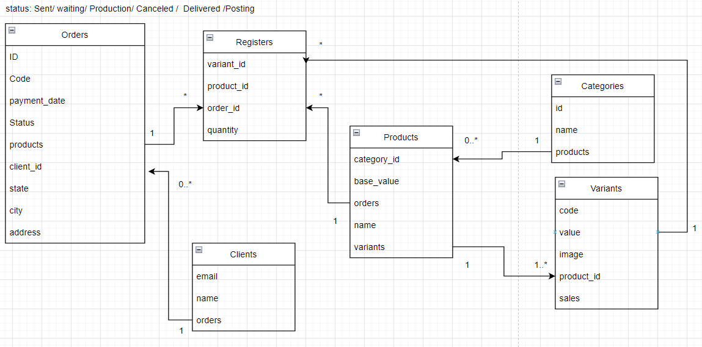

# ACME API
## Setup

#### Docker
- Install [Docker Engine and Docker-Compose](https://docs.docker.com/engine/install/)

- Rename `.env.example` for `.env`

- On file `./entrypoint.sh` > replace in L#4 for `bundle exec rails db:create db:migrate`

- Execute on project's directory `$ docker-compose up app`

#### Local

- Install Ruby 3.0.4 and Rails 7 (Use RVM with you perfer)

- Put that code bellow on `config/database.yml` and put your local machine variables for connection PG

```
development:
  <<: *default
  database: acme_development
  username: <your_user>
  password: <your_password>
  host: 127.0.0.1

test:
  <<: *default
  username: <your_user>
  password: <your_password>
  host: 127.0.0.1
  database: acme_test
```

- Install globally nodemon for listen file changes `$ npm i -g nodemon` Than execute `$ nodemon -L --exec "./rails.sh"`

- Or if you perfer, only execute `$ rails db:create db:migrate && rails s`


#### Import CSV
On Concerns: [acme/app/models/concerns/import_data.rb](https://github.com/Vitor-Novaes/acme/blob/main/app/models/concerns/import_data.rb)


## ERB


